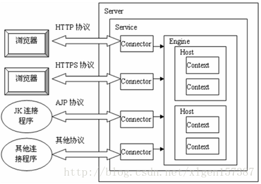
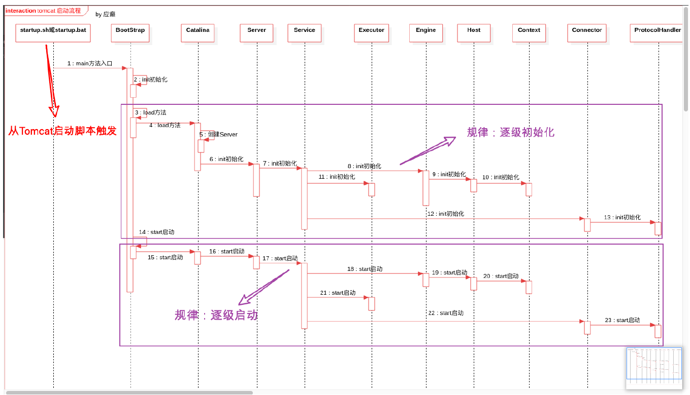
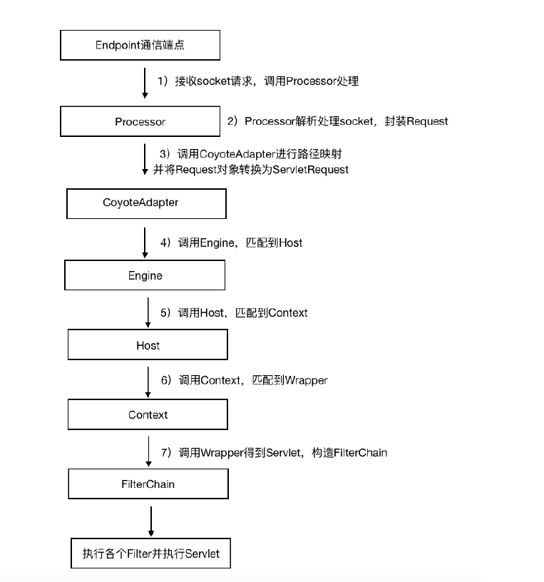

## TinyTomcat

> 基于 NIO 模式实现的简化版 Tomcat

简化实现 Server、Service、Host、Engine 等组件，通过解析 Server.xml 和 Web.xml 文件初始化服务器。

实现的主要功能：
- Context
- Servlet
- Filter
- Session
- Cookie
- Request
- Response
- Get & Post
- Keep-alive
- WebappClassLoader
- ......

### Tomcat 组件

### Tomcat 启动流程

### Tomcat NIO 工作流程

从上图中,可以看出一个 Connector 包含一个 Http11NioProtocol 实例、一个 CoyoteAdapter 实例，Http11NioProtocol 内部包含一个 NioEndpoint 实例、一个 Http11ConnectionHandler 实例。NioEndpoint 主要是实现了 Socket 请求监听线程 Acceptor、Socket NIO Polle r线程、以及请求处理线程池。

1. 对于 Acceptor 监听到的Socket请求，经过 NioEndpoint 内部的 NIO 线程模型处理后，会转变为 SocketProcessor 在 Executor 中运行;
2. SocketProcessor 在 run 过程中会交给 Http11ConnectionHandler 处理，Http11ConnectionHandler 会从ConcurrentHashMap<NioChannel,Http11NioProcessor> 缓存中获取相应的 Http11NioProcessor 来继续处理;
3. Http11NioProcessor 主要是负责解析 Socket 请求 Header，解析完成后，会将 Request、Response（这里的请求、响应在tomcat中看成是 coyote 的请求、响应，意思是还需要 CoyoteAdapter 处理）交给 CoyoteAdapter 继续处理;
4. CoyoteAdapter 主要将 Socket 解析的 Request、Response 转化为 HttpServletRequest、HttpServletResponse，而这里的请求响应就是最后交给 Container 去处理的。

